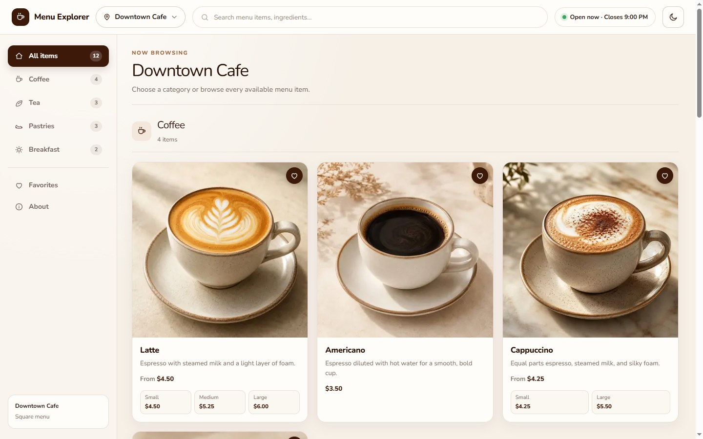
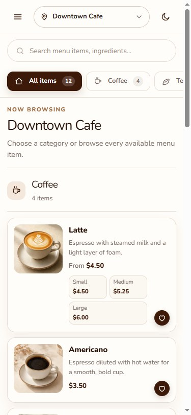

# Square Menu Explorer

A mobile-first menu browser built for the Per Diem full-stack coding challenge. It reads live catalog and location data from Square through server-side Next.js Route Handlers, so the access token never reaches the browser.

**Live demo: [square.muhammadfaza.com](https://square.muhammadfaza.com)**

| Desktop — 1440×900 | Mobile — 375×812 |
| --- | --- |
|  |  |

Lighthouse on the deployed app — **accessibility 100 on both**:

| | Performance | Accessibility | Best Practices | SEO |
| --- | :---: | :---: | :---: | :---: |
| Desktop | 100 | 100 | 96 | 100 |
| Mobile | 99 | 100 | 96 | 100 |

Assessing this against the brief? [`REQUIREMENTS.md`](REQUIREMENTS.md) maps every requirement to the code that implements it and the test that covers it. `pnpm test` runs all of them and needs no credentials.

## What it does

- **Location switching** — pick any active Square location; the menu, business hours, and availability all follow. The choice persists in `localStorage`.
- **Live open/closed status** — derived from each location's Square business hours in its own IANA timezone.
- **Per-location availability** — items appear only where Square says they are sold, including variation-level absence.
- **Search, favorites, dark mode** — client-side search over the loaded menu, per-item favorites in `localStorage`, and a light/dark theme with no flash on load.
- **Accessible by construction** — ARIA APG combobox for the location picker, roving-tabindex category navigation, a focus-trapped mobile drawer, live-region announcements, and full `prefers-reduced-motion` support.

## Quick start

Requires Node.js `^20.19.0 || ^22.13.0 || >=24.0.0` and pnpm 10, plus a Square **Sandbox** account.

```bash
pnpm install
cp .env.example .env.local   # then fill in the values below
pnpm dev                     # http://localhost:3000
```

`.env.local`:

| Variable | Required | Notes |
| --- | --- | --- |
| `SQUARE_ACCESS_TOKEN` | yes | Server-only. Never expose it via a `NEXT_PUBLIC_` variable. |
| `SQUARE_ENVIRONMENT` | yes | Exactly `sandbox` or `production`. |
| `PORT` | yes | Integer from 1–65535. |
| `SQUARE_APPLICATION_ID` | no | Identification only; not used to authenticate requests. |
| `SQUARE_WEBHOOK_SIGNATURE_KEY` | no | Enables the cache-invalidation webhook. Unset disables it. |
| `SQUARE_WEBHOOK_NOTIFICATION_URL` | no | Must exactly match the Square subscription URL — it is part of the signed payload. |

The test suite is deterministic and needs no credentials.

## Seeding the sandbox

A fresh Square sandbox has one location and a flat item list, which cannot demonstrate per-location availability. This script builds a catalog that does:

```bash
node scripts/seed-sandbox.mjs
```

It refuses to run unless `SQUARE_ENVIRONMENT=sandbox`, never prints the token, and is idempotent — existing locations and items are skipped, so re-runs are safe.

**Locations.** It renames the default `Default Test Account` to **Downtown Cafe** and adds two more, each with seven-day 07:00–21:00 business hours:

| Location | Timezone | Items |
| --- | --- | --- |
| Downtown Cafe | `America/New_York` | 12 |
| Riverside Cafe | `America/New_York` | 14 |
| Harbor Point Roastery | `America/Los_Angeles` | 13 |

**Menu.** Four categories — Coffee, Tea, Pastries, Breakfast. Most items are present everywhere; these are the ones that differ, and each exercises a different Square availability mechanism:

| Item | Downtown | Riverside | Harbor Point | Mechanism |
| --- | :---: | :---: | :---: | --- |
| Cold Brew | — | ✅ | ✅ | `present_at_location_ids` |
| Iced Hibiscus Tea | — | ✅ | — | `present_at_location_ids` |
| Banana Bread | — | — | ✅ | `present_at_location_ids` |
| Cinnamon Roll | — | ✅ | ✅ | `absent_at_location_ids` |
| Matcha Latte | ✅ | — | ✅ | `absent_at_location_ids` |
| Avocado Toast | ✅ | ✅ | — | `absent_at_location_ids` |
| Egg and Cheese Sandwich | ✅ | ✅ | — | `absent_at_location_ids` |
| Flat White | ✅ | ✅&nbsp;¹ | ✅ | variation-level absence |

¹ Flat White itself is sold everywhere, but its **Large** variation is absent at Riverside — so Riverside shows the item with only the Small chip.

Two behaviors worth checking while reviewing: **Breakfast disappears entirely at Harbor Point** (both of its items are absent there, and empty categories are hidden), and every location shows a different item count.

> **Note:** the script assigns categories by hardcoded sandbox category ID. Run against the original sandbox it seeds cleanly; run against a *different* sandbox, those IDs will not resolve and the new items fall back to `Uncategorized` — which is handled and covered by tests, but is not the intended demo state.

Two Square quirks this surfaced: `SearchCatalogObjects` returns related IMAGE objects but *not* the `CatalogCategory` objects behind `item_data.categories[]`, so the gateway runs a second CATEGORY pass; and a variation cannot be enabled at a location where its parent item is disabled.

## Commands

```bash
pnpm lint:fix    # ESLint autofix, then strict TypeScript checking
pnpm test        # Vitest unit/integration/component tests
pnpm build       # production build
pnpm start       # serve the built standalone app
pnpm test:e2e    # build, then Playwright at desktop and exactly 375px
pnpm verify      # every gate with a single build
```

Run `pnpm exec playwright install chromium` once if Chromium is not installed.

`pnpm start` and the E2E suite both run `.next/standalone/server.js`, the same entrypoint the Docker image uses, so the tests exercise the artifact that actually ships rather than a development server.

Tests are layered: unit for Square semantics, money, and caching; integration across the Route Handler → service → gateway → mapper chain with only the SDK faked; component tests on real hooks in jsdom; and E2E against a built app with HTTP intercepted, so no credentials are ever used.

## Docker

```bash
docker compose up --build
```

Builds the standalone output (`next.config.ts` sets `output: "standalone"`). Secrets are read at runtime from `.env.local` and never baked into the image. The published port follows `PORT`; a healthcheck polls `GET /api/locations`.

## API

All three endpoints return JSON with `Cache-Control: no-store` and a correlating `x-request-id`. Errors use a typed public envelope — raw Square errors are never forwarded.

```text
GET /api/locations                              # active locations only
GET /api/catalog?location_id=<ID>               # categories with nested items
GET /api/catalog/categories?location_id=<ID>    # nonempty categories with counts
```

A missing, duplicated, or malformed `location_id` returns `400`; a well-formed ID that is not an active location returns `404` without touching the catalog.

`POST /api/webhooks/square` invalidates the catalog cache when Square sends `catalog.version.updated`, instead of waiting out the TTL. Each delivery is verified by recomputing `base64(HMAC-SHA256(key, notificationUrl + rawBody))` and comparing it against the `x-square-hmacsha256-signature` header in constant time. Bad signature → `401`; unparseable body → `400`; unconfigured → `503`.

## How it works

One Next.js App Router application serves both the UI and the server-only Square proxy. The official `square` SDK sits behind lazy gateways marked `server-only`, so a stray client import fails at build time rather than leaking the token. A pure mapper converts Square's shapes into the public DTOs, which keeps availability rules, money handling, and error translation independently testable.

Some deliberate choices worth calling out:

| Decision | Trade-off accepted |
| --- | --- |
| Fully paginate before mapping | A late-page failure rejects the whole request, but no partial menu can ever render |
| One 5-minute in-memory cache per location, shared by both catalog endpoints | Process-local, so it is lost on restart and not shared across instances |
| Money kept in integer minor units, compared and formatted with `BigInt` | More ceremony than floats, but no precision loss and no hardcoded `$` |
| Strict runtime validation of both endpoints before React sees them | Rejects a mismatched pair as one error instead of rendering contradictory navigation |
| Business hours computed with `Intl` in the location's timezone | No date library added; status is `unknown` when hours or timezone are missing |

Concurrent loads are race-guarded: a location change aborts both in-flight requests and bumps a sequence counter, so a slow earlier response can never overwrite a newer menu.

## Known limits

Each of these is a deliberate boundary rather than an unfinished edge, with the reasoning behind it:

- **The catalog cache is process-local**, so it is lost on restart and not shared across instances. A single process is the right size for this challenge; scaling out would move the same interface to Redis, which is why invalidation is already event-driven rather than TTL-only.
- **Cache hits skip active-location revalidation until expiry**, so deactivating a location can stay visible for up to the remaining TTL. Revalidating on every hit would defeat the cache; the webhook covers catalog changes, which are the ones that actually churn.
- **Configuration is validated lazily at request time**, not at build time, so the image builds without credentials and fails with a sanitized error only when a request truly needs Square.
- **The Nunito font loads through `next/font/google`**, so the first production build needs network access. Subsequent builds reuse the cached font.
- **The item card is the terminal view** — the brief's only interaction requirement is that choosing a category navigates the menu, which is implemented and covered by E2E. A detail view was out of scope rather than incomplete.

## More

- `Full Stack Coding Challenge - Feb 2026.md` — the brief this was built against.
- `REQUIREMENTS.md` — every requirement mapped to its implementation and test.
- `AGENTS.md` — orientation for anyone reading the codebase.

The long-form development README, with the complete mapping contract and per-endpoint semantics, is archived locally at `docs/README-full.md` (gitignored).
